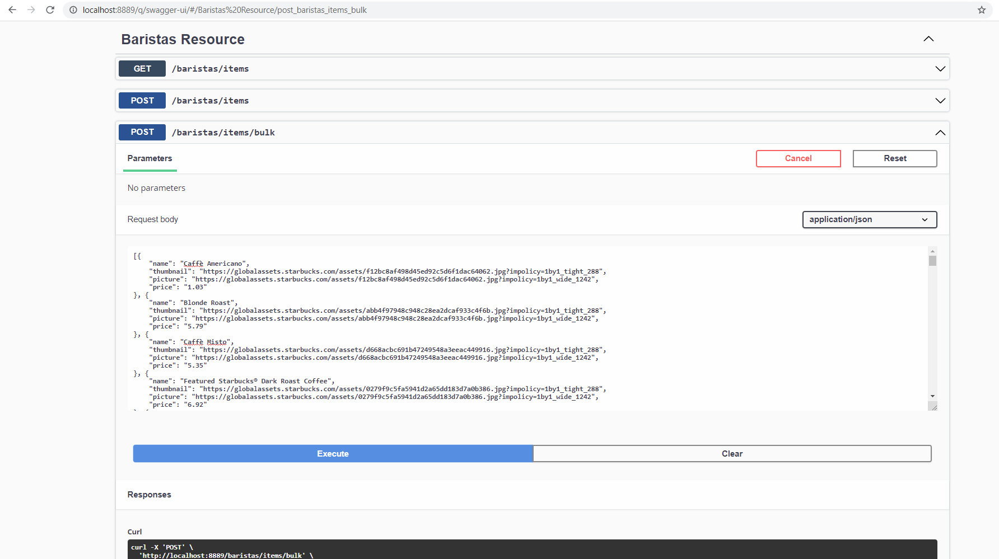

<p align="center">

</p>

**Coffee Express** is a cloud-native microservices demo application. The application is a web-based app for a coffee shop, where users can use this application to browse menu of coffees, add them in a cart and purchase them.

**Coffee Express shows how to build & run a microservices-based application**. It shows usage of sorts of different microservices patterns. It also demonstrate use of Kubernetes and how you can deploy a microservices application in Kubernetes. Application can be deployed locally in `Minikube cluster`. It requires **little to no configuration for deploying**.

## Screenshots

Menu             |  Cart
:-------------------------:|:-------------------------:
  |  
Checkout             |  Order Track
  |  
Order Details             |  Orders History
  |  
Bank Accounts               
 

## Building and running the microservices
Coffee Express can run either using Docker Compose or a Kubernetes Cluster(only tested in minikube). In both options you need to first build all java projects using maven, then build local docker images. You can do this by executing these batch files in a terminal:

```
1: ./build-packages.bat
2: ./build-images.bat
```

After all Docker images have been created, you can either use `docker-compose up` or if you want to run on `Kubernetes minikube cluster`, follow these steps:

1. **First you need to have a Kubernetes cluster up and running**. For this process you can use [Minikube](https://minikube.sigs.k8s.io/docs/). Begin by downloading [minikube binaries](https://minikube.sigs.k8s.io/docs/start/) depending on your OS/architecture. After downloading binaries you can use `minikube cli command` to start cluster. For a quickstart of minikube cluster, you can run minikube as a Docker container, by using this command:
```
minikube start --driver=docker
```

2. After minikube cluster is up and running you can then proceed to **deploy coffee-express microservices** in Kubernetes (`don't forget to first build docker images`). 
First you need to create a secret that contains all necessary usernames & passwords and create a ConfigMap that will import a Keycloak realm from a json file. You can do both of these by executing batch file:

```
./create-secret-and-keycloak-import.bat
```

Then, change directory to `kubernetes/` and run this command:

```
kubectl apply -f .
```

3. **Wait for the Pods to be ready.**

```
kubectl get pods
```

After a few minutes, (after pulling all necessary docker images and starting up pods) you should see something like this:

```
NAME                                      READY   STATUS    RESTARTS   AGE
activemq-artemis-0                        1/1     Running   0          2m1s
api-gateway-service-7c89fdbfb4-z4n8v      1/1     Running   3          2m1s
barista-service-555499fd74-tdpgv          1/1     Running   3          2m1s
customers-service-7d7964cb4d-9bzm9        1/1     Running   3          2m1s
finance-service-5f46499b94-4z87c          1/1     Running   2          2m1s
keycloak-59c4d545cd-5rtcz                 1/1     Running   0          2m1s
mongodb-set-0                             1/1     Running   0          2m1s
mysql-6c8d4bdbd9-6zvb5                    1/1     Running   0          2m
orders-history-service-65bdffc7c6-lnb6q   1/1     Running   0          2m
orders-service-57bf9dbc68-hxsrc           1/1     Running   3          2m
```

Now all the pods are up and running.

## Using the web application
All microservices are written in Quarkus (Java 11). Each of these services will expose it's own API through an OpenAPI specification and you can also test these APIs using a user-friendly UI named SwaggerUI. Each service's SwaggerUI is accessible on `http://service-url:service-port/q/swagger-ui`.
You can test each service's API by using their SwaggerUI. This is not easy to do. That's why Coffee Express make use of API-Gateway pattern, and have a service called Api-Gateway-service. By using API-gateway service, clients will use this service to communicate with all other services.

Coffee-Express have it's own (frontend UI) that is built with Vue.js. (For now Vue.js app it's not run in docker-compose neither in Kubernetes cluster). That's why you should run this app by changing directory to `/coffee-vue-client`, where all of Vue.js app is written. You can start this by using command:

```
yarn serve --port 3333 (cors is used in api-gateway and port 3333 is accepted as origin by api-gateway)
```

After Vue.js app is up and running you can access the WebUI in `http://localhost:3333`. Keep in mind that frontend will communicate only with Api-gateway (that's why when using Kubernetes you must use port-forwarding to access api-gateway):

```
kubectl port-forward svc/api-gateway-service 8085:8080
Note: Port 8085 is the port that frontend uses to communicate with api-gateway. If you want to change that port you should modify file `API.js` and change variable BASE_URL!
```

### Adding menuitems
In frontend you can browse everything that Coffee-Express offers (menu and if logged in as a user: orders of user, bankaccounts, profile, placing orders and so on...). But application will start with no menuitem in database of barista service, that's why you can create some menuitems by using `Barista-service's API/SwaggerUI` (visit in browser `http://barista-service-url:barista-service-port`) You can use some menuitems that I got from starbucks official website. You will find these menuitems in a json file in coffee express app directory. Copy menuitems and paste in SwaggerUI (post_baristas_items_bulk) and send a POST request to service. And if everything goes right, these menuitems will be stored in database.

<p align="left">

</p>

Note: If Kuberenetes is used, then you can't access barista's service directly outside of cluster. That means that if you want to access via localhost you should use port-forwarding:

```
kubectl port-forward svc/barista-service 8083:8080
```

Now you can access barista-service directly on `http://localhost:8083`.

### Logging in
When you open the frontend, you can browse only the menu without being logged in in application. So if you want to use other feautures of the app you need to login. During application startup, there is one user (withh admin role) that is created, both in customers-service and the keycloak-service. You can use this user to immediately login and test the application or you can signup with a new user by visiting signup page in frontend (keep in mind that all the users that are created from signup page, are assigned with a simple "user role and not admin role". Credentials to login as admin:

```
Username: fisnikz
Password: 123456
```

## Architecture

| Service                                              | Language (Framework)      | Description|
| ---------------------------------------------------- | ------------- | --------------------------------------------------------------------------------------------------------------------------------- |
| [orders service](./orders)                  | Java 11 (Quarkus)         | Handles placing/managing orders. It also plays role of "orchestrator" during the "place order" process (using sagas pattern) |
| [finance service](./finance) | Java 11 (Quarkus)            | Make a payment using credit card info (mock) with the given amount and save the payments in db.                        |
| [barista service](./barista)             | Java 11 (Quarkus)       | The barista that provides list of menuitems. It also manages the process of accepting and preparing orders. |
| [customers service](./customers)               | Java 11 (Quarkus)       | Responsible for saving customers details (not the login info of accounts (Keycloak is used as identity provider).                                     |
| [orders history service](./orders-history)             | Java 11 (Quarkus)            | Takes all the information about orders from each service, and saves them in a NoSQL database (CQRS Pattern) |
| [api gateway service](./api-gateway)                   | Java 11 (Quarkus)        | The "front door" to the application. Each external request will communicate directly only with this service. Then api-gateway forwards the requests to the corresponding service and finally sends response. |
| [frontend](./coffee-vue-client)                      | Javascript (Vue.js)        | Exposes an web UI that is accesisable in the browser. |

## Features

- **Usage of Microservices Patterns:**
  As mentioned before, this application is based on Microservices Architecture. That's why the whole application is designed to use sorts of Microservices Patterns and "best practices" when dealing with Microservices. Some of the patterns that are used:
  - Communication Patterns (Synchronous and Asynchronous)
  - Circuit Braker Pattern
  - Sagas Pattern
  - CQRS (Command and Query Responsibility Segregation)
  - Security in Microservices (JWT)
  - API Gateway
- **Docker:**
  Docker simplifies the delivery and managment of Microservices using containers. Each service provides a Dockerfile that can be used to build the images and start the containers. Because there are multiple services, the best way to define and run multiple containers is to use Docker Compose. You can find a docker-compose.yml file in the application base directory.    
- **Kubernetes:**
  The app is also designed to run on Kubernetes (locally on Minikube). You can find all the configuration yaml files for each of service in the `/kubernetes` dir.
